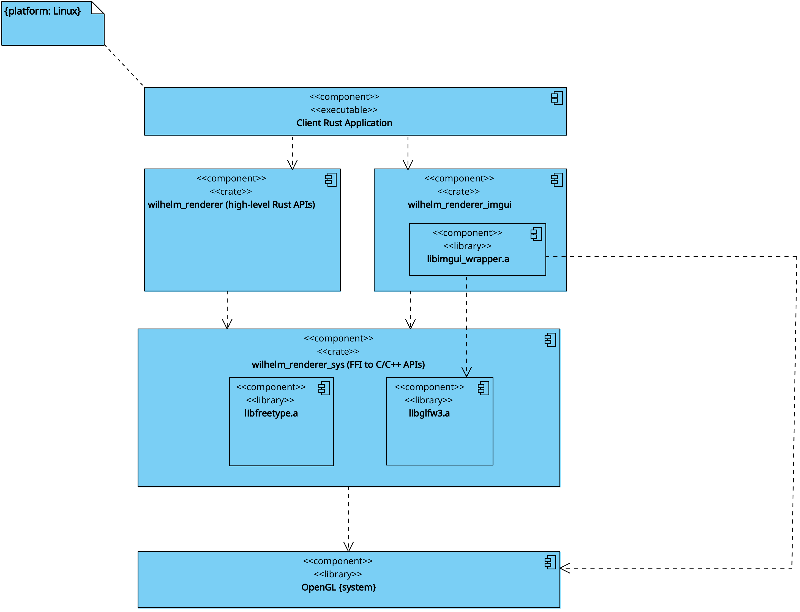

# wilhelm_renderer_imgui

Dear ImGui integration for the [wilhelm_renderer](https://crates.io/crates/wilhelm_renderer) stack.

Bundles Dear ImGui v1.91.8 with the GLFW and OpenGL3 backends, compiled as a static library with C FFI wrappers for Rust.

## Architecture

`wilhelm_renderer_imgui` is a **sibling** of `wilhelm_renderer` — neither depends on the other. Both depend on `wilhelm_renderer_sys`, which bundles GLFW and provides the shared window/OpenGL context. Your application combines them: it asks `wilhelm_renderer` for a window, then hands the GLFW window pointer to `ImGui::new`.



The diagram above is platform-scoped to Linux (static library names use the `lib*.a` convention). On Windows MSVC the equivalent artifacts are `glfw3.lib`, `freetype.lib`, and `imgui_wrapper.lib`.

Quick textual view:

```
┌─────────────────────────────────────────────────────────────┐
│                    Application                              │
├──────────────────────────┬──────────────────────────────────┤
│   wilhelm_renderer       │   wilhelm_renderer_imgui         │
│   (App, Window,          │   (Dear ImGui + GLFW/GL3         │
│    Renderer, Color,      │    backends)                     │
│    graphics2d)           │                                  │
├──────────────────────────┴──────────────────────────────────┤
│   wilhelm_renderer_sys (FFI + bundled GLFW/FreeType/glad)   │
├─────────────────────────────────────────────────────────────┤
│   OpenGL (system)                                           │
└─────────────────────────────────────────────────────────────┘
```

## Installation

Add both sibling crates to your `Cargo.toml`:

```toml
[dependencies]
wilhelm_renderer = "0.12"
wilhelm_renderer_imgui = "0.9"
```

The two crates must agree on the underlying `wilhelm_renderer_sys` version (they share one statically-linked `libglfw3.a`). The published versions above are pinned to compatible sys versions; if you override either dependency, ensure both transitively pull in the same `wilhelm_renderer_sys`.

### Build Requirements

- C++ compiler and CMake
- Linux: `libgl1-mesa-dev`
- Dear ImGui is bundled — no external ImGui dependency needed
- GLFW is supplied by `wilhelm_renderer_sys` — no system GLFW required

## Usage

```rust
use std::cell::RefCell;
use std::rc::Rc;

use wilhelm_renderer::core::{App, Color, Window};
use wilhelm_renderer::graphics2d::shapes::{ShapeKind, ShapeRenderable, ShapeStyle, Triangle};
use wilhelm_renderer_imgui::ImGui;

fn main() {
    let window = Window::new("Demo", 800, 600, Color::from_rgb(0.1, 0.1, 0.15));
    let mut app = App::new(window);

    // Add a triangle
    let mut triangle = ShapeRenderable::from_shape(
        ShapeKind::Triangle(Triangle::new([
            (-100.0, 50.0), (100.0, 50.0), (0.0, -100.0),
        ])),
        ShapeStyle::fill(Color::from_rgb(0.2, 0.6, 0.9)),
    );
    triangle.set_position(400.0, 300.0);
    app.add_shape(triangle);

    // Initialize ImGui
    let imgui = ImGui::new(app.window.glfw_window_ptr(), true);

    // Shared state (modified by ImGui, read by pre_render)
    let pos_x = Rc::new(RefCell::new(400.0f32));
    let pos_y = Rc::new(RefCell::new(300.0f32));
    let scale = Rc::new(RefCell::new(1.0f32));

    let (pos_x_update, pos_y_update, scale_update) =
        (Rc::clone(&pos_x), Rc::clone(&pos_y), Rc::clone(&scale));

    // Update shape properties before rendering
    app.on_pre_render(move |shapes, _| {
        if let Some(shape) = shapes.first_mut() {
            shape.set_position(*pos_x_update.borrow(), *pos_y_update.borrow());
            shape.set_scale(*scale_update.borrow());
        }
    });

    // ImGui controls
    app.on_render(move |_renderer, _camera| {
        imgui.new_frame();

        imgui.begin("Shape Controls", None, 0);
        imgui.text("Position");
        imgui.slider_float("X", &mut pos_x.borrow_mut(), 0.0, 800.0);
        imgui.slider_float("Y", &mut pos_y.borrow_mut(), 0.0, 600.0);
        imgui.separator();
        imgui.text("Transform");
        imgui.slider_float("Scale", &mut scale.borrow_mut(), 0.1, 3.0);
        imgui.end();

        imgui.render();
    });

    app.run();
}
```

## Available Widgets

- **Windows**: `begin`, `end`, `set_next_window_pos/size`
- **Text/Buttons**: `text`, `button`, `checkbox`
- **Sliders/Input**: `slider_float/int`, `input_float/int`
- **Color**: `color_edit3/4`
- **Layout**: `same_line`, `separator`, `spacing`, `indent`
- **Tree**: `tree_node`, `tree_pop`
- **Combo**: `begin_combo`, `end_combo`, `selectable`
- **Menu**: `begin_main_menu_bar`, `begin_menu`, `menu_item`
- **Tables**: `begin_table`, `table_next_row/column`, `table_setup_column`
- **Popups**: `begin_popup`, `open_popup`, `close_current_popup`
- **Demo**: `show_demo_window`

## Example

Run the interactive demo:

```bash
cargo run --example demo
```

## License

MIT
